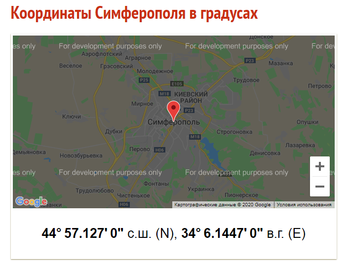
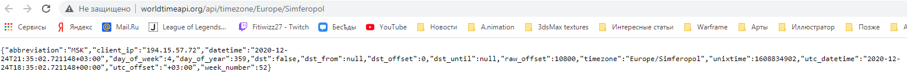
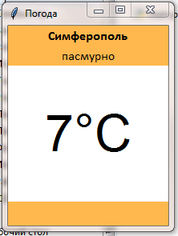

<p align="center">МИНИСТЕРСТВО НАУКИ  И ВЫСШЕГО ОБРАЗОВАНИЯ РОССИЙСКОЙ ФЕДЕРАЦИИ<br>
Федеральное государственное автономное образовательное учреждение высшего образования<br>
"КРЫМСКИЙ ФЕДЕРАЛЬНЫЙ УНИВЕРСИТЕТ им. В. И. ВЕРНАДСКОГО"<br>
ФИЗИКО-ТЕХНИЧЕСКИЙ ИНСТИТУТ<br>
Кафедра компьютерной инженерии и моделирования</p>
<br>

<h3 align="center">Отчёт по лабораторной работе № 1<br> по дисциплине "Программирование"</h3>

<br><br>

<p>студента 1 курса группы ПИ-б-о-202(1)<br>
Бойченко Сергея Павловича<br>
направления подготовки 09.03.04 "Программная инженерия"</p>
<br><br>

<table>
<tr><td>Научный руководитель<br> старший преподаватель кафедры<br> компьютерной инженерии и моделирования</td>
<td>(оценка)</td>
<td>Чабанов В.В.</td>
</tr>
</table>
<br><br>

<p align="center">Симферополь, 2020</p>
<hr>

## Цель:


1. Закрепить навыки разработки многофайловыx приложений;
2. Изучить способы работы с API web-сервиса;
3. Изучить процесс сериализации/десериализации данных в/из json;
4. Получить базовое представление о сетевом взаимодействии приложений;

## Постановка задачи
Разработать сервис предоставляющий данные о погоде в городе Симферополе на момент запроса. В качестве источника данных о погоде использовать: http://openweathermap.org/. В состав сервиса входит: серверное приложение на языке С++ и клиентское приложение на языке Python.
Серверное приложение (далее Сервер) предназначенное для обслуживания клиентских приложений и минимизации количества запросов к сервису openweathermap.org. Сервер должен обеспечивать возможность получения данных в формате JSON и виде html виджета (для вставки виджета на страницу будет использоваться iframe).
Клиентское приложение должно иметь графический интерфейс отображающий сведения о погоде и возможность обновления данных по требованию пользователя.

## Выполнение работы

### Задание 1

​	Заходим на сайт http://openweathermap.org/ и регистрируемся. Подтверждаем регистрацию на почте и логинимся на сайте. Переходим в наш аккаунт и генерируем API key. Полученный ключ представлен ниже.

c4acec87ef8b2efa7d453114d03c8679

​	Подставляем наш ключ в ссылку, которая имеет следующий вид.

http://api.openweathermap.org/data/2.5/forecast?id=524901&appid=[{API key}](https://home.openweathermap.org/api_keys)

​	Переходим по созданной ссылке и получаем следующий результат в виде JSON кода. (Рис. 1.1)


<center> <i > Рисунок 1.1. Полученный запрос с сайта. </center>

​	Далее нам нужно получить прогноз погоды для Симферополя с почасовым интервалом, в градусах Цельсия и на русском языке. Координаты Симферополя были взяты с сайта https://mysuntime.ru/coordinates/ru.simferopol/. (Рис. 1.2)



<center> <i > Рисунок 1.2. Полученный запрос с сайта. </center>

​	Создаем ссылку и переходим на сайт.


<center> <i > Рисунок 1.3. Созданная ссылка погоды для Симферополя.  </center>

https://api.openweathermap.org/data/2.5/onecall?lat=44.571270&lon=34.614470&exclude=hourly&units=metric&lang=ru&appid=c4acec87ef8b2efa7d453114d03c8679

Разберем ссылку подробнее.

1. lat=44.571270 – координаты южной широты.

2. lon=34.614470 – координаты западной долготы.

3. exclude=hourly – почасовой интервал.

4. units=metric – метрическая мера измерения.

5. lang=ru – язык вывода русский.

6. appid=c4acec87ef8b2efa7d453114d03c8679 – полученный API key.

​	Полученный JSON код вставляем в сайт https://codebeautify.org/jsonviewer для более удобного обозревания. (Рис. 1.4)

​	Из дерева становится понятно, что температура составляет 8.97℃, ощущается на 3.67℃, а погода является ясной.


<center> <i > Рисунок 1.4. Вид нашего JSON кода в виде дерева. </center>

### Задание 2

​	Для получения время в Симферополе в формате JSON, надо составить запрос с сайта  http://worldtimeapi.org/. Для этого составляем ссылку (http://worldtimeapi.org/api/timezone/Europe/Simferopol) и переходим по ней. (Рис. 2.1, Рис. 2.2)



<center> <i > Рисунок 2.1. Созданная ссылка для вермени в Симферополе.</center>


<center> <i > Рисунок 2.2. Вид нашего JSON кода в виде дерева. </center>

### Задание 3

​	Для того, чтобы создать серверное приложение, надо установить библиотеку "httplib.h".

​	После установки библиотеки копируем код и запскаем программу. Должно вывестись "Start server... OK". Далее переходим по ссылке http://localhost:1234/ и если там будет сообщение "Hello, World!", то значит все было сделано верно. (Рис. 3.1)

```
#include <iostream>
#include <cpp_httplib/httplib.h>
using namespace httplib;
 
// В этой функции формируем ответ сервера на запрос
void gen_response(const Request& req, Response& res) {
  // Команда set_content задаёт ответ сервера и тип ответа:
  // Hello, World! - тело ответа
  // text/plain - MIME тип ответа (в данном случае обычный текст)
  res.set_content("Hello, World!", "text/plain");
}
 
int main(){
  Server svr;                    // Создаём сервер (пока-что не запущен)
  svr.Get("/", gen_response);    // Вызвать функцию gen_response если кто-то обратиться к корню "сайта"
  std::cout << "Start server... OK\n";
  svr.listen("localhost", 1234); // Запускаем сервер на localhost и порту 1234
}
```


<center> <i > Рисунок 3.1. Вывод сообщения. </center>

​	Далее создаем новый проект, подключаем библиотеку "httplib.h". Для получения данных от сервисов https://openweathermap.org/ и http://worldtimeapi.org/ нужно будет посылать им get-запросы. Копируем код и запускаем его. Должен вывестись ответ от http://worldtimeapi.org/ в виде JSON. (Рис. 3.2)

```
#include <iostream>
#include <cpp_httplib/httplib.h>
using namespace httplib;
 
int main(){
  // Создаём клиент и привязываем к домену. Туда пойдут наши запросы
  Client cli("http://worldtimeapi.org");
  // Отправляем get-запрос и ждём ответ, который сохраняется в переменной res
  auto res = cli.Get("/api/timezone/Europe/Simferopol");
  // res преобразуется в true, если запрос-ответ прошли без ошибок
  if (res) {
    // Проверяем статус ответа, т.к. может быть 404 и другие
    if (res->status == 200) {
      // В res->body лежит string с ответом сервера
      std::cout << res->body << std::endl;
    }else{
      std::cout << "Status code: " << res->status << std::endl;
    }
  }
  else {
    auto err = res.error();
    std::cout << "Error code: " << err << std::endl;  
  }
}
```



<center> <i > Рисунок 3.2. Вывод сообщения. </center>

## Вывод по работе. 

Цель работы была успешно достигнута. Было выполнено:
- Создание сервера на языке С++, обращающегося к openweathermap.com и возвращающий виджет или описание и температуру в формате json
- Приложение с графическим интерфейсом, написанное на языке Python с использованием библиотеки Tkinter, получающее и обрабатывающее данные из сервера.