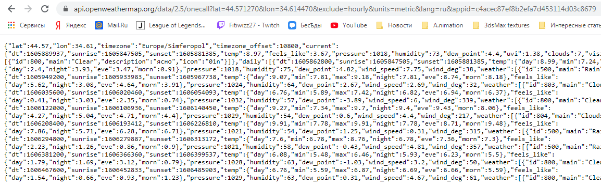
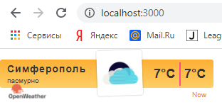

<p align="center">МИНИСТЕРСТВО НАУКИ  И ВЫСШЕГО ОБРАЗОВАНИЯ РОССИЙСКОЙ ФЕДЕРАЦИИ<br>
Федеральное государственное автономное образовательное учреждение высшего образования<br>
"КРЫМСКИЙ ФЕДЕРАЛЬНЫЙ УНИВЕРСИТЕТ им. В. И. ВЕРНАДСКОГО"<br>
ФИЗИКО-ТЕХНИЧЕСКИЙ ИНСТИТУТ<br>
Кафедра компьютерной инженерии и моделирования</p>
<br>

<h3 align="center">Отчёт по лабораторной работе № 1<br> по дисциплине "Программирование"</h3>

<br><br>

<p>студента 1 курса группы ПИ-б-о-202(1)<br>
Бойченко Сергея Павловича<br>
направления подготовки 09.03.04 "Программная инженерия"</p>
<br><br>

<table>
<tr><td>Научный руководитель<br> старший преподаватель кафедры<br> компьютерной инженерии и моделирования</td>
<td>(оценка)</td>
<td>Чабанов В.В.</td>
</tr>
</table>
<br><br>

<p align="center">Симферополь, 2020</p>
<hr>

## Цель:


1. Закрепить навыки разработки многофайловыx приложений;
2. Изучить способы работы с API web-сервиса;
3. Изучить процесс сериализации/десериализации данных в/из json;
4. Получить базовое представление о сетевом взаимодействии приложений;

## Постановка задачи
Разработать сервис предоставляющий данные о погоде в городе Симферополе на момент запроса. В качестве источника данных о погоде использовать: http://openweathermap.org/. В состав сервиса входит: серверное приложение на языке С++ и клиентское приложение на языке Python. Серверное приложение (далее Сервер) предназначенное для обслуживания клиентских приложений и минимизации количества запросов к сервису openweathermap.org. Сервер должен обеспечивать возможность получения данных в формате JSON и виде html виджета (для вставки виджета на страницу будет использоваться iframe).
Клиентское приложение должно иметь графический интерфейс отображающий сведения о погоде и возможность обновления данных по требованию пользователя.

## Выполнение работы

### Задание 1

Заходим на сайт http://openweathermap.org/ и регистрируемся. Подтверждаем регистрацию на почте и логинимся на сайте. Переходим в наш аккаунт и генерируем API key. Полученный ключ представлен ниже.

c4acec87ef8b2efa7d453114d03c8679

Далее подставляем наш ключ в ссылку, которая будет имеет следующий вид: http://api.openweathermap.org/data/2.5/forecast?id=524901&appid=c4acec87ef8b2efa7d453114d03c8679

Переходим по созданной ссылке и получаем следующий результат в виде JSON кода.


Рисунок 1.

Далее нам нужно получить прогноз погоды для Симферополя с почасовым интервалом, в градусах Цельсия и на русском языке. Координаты Симферополя были взяты с сайта https://mysuntime.ru/coordinates/ru.simferopol/

Рисунок 2.

Создаем ссылку и переходим на сайт: https://api.openweathermap.org/data/2.5/onecall?lat=44.571270&lon=34.614470&exclude=hourly&units=metric&lang=ru&appid=c4acec87ef8b2efa7d453114d03c8679



Рисунок 3.

Полученный JSON код вставляем в сайт https://codebeautify.org/jsonviewer для более удобного обозревания.


Рисунок 4.

### Задание 2

Запрос для сервера погоды включает в себя город, время которого необходимо получить.


Рисунок 5.

### Задание 3

Сервер имеет следующий код:

```C++
#include <iostream>
#include <string>
#include "include/nlohmann/json.hpp"
#include "include/cpp_httplib/httplib.h"
#include <fstream>

using namespace std;
using namespace httplib;
using json = nlohmann::json;

string Shablon;
string cache;

void gen_response(const Request& req, Response& response)
{
	//
	Client worldtimeapi("http://worldtimeapi.org");
	auto res_worldtimeapi = worldtimeapi.Get("/api/timezone/Europe/Simferopol");

	if (!res_worldtimeapi)
	{
		response.set_content("Нет ответа от сервера времени ", "text/plain");
		return;
	}
	else if (res_worldtimeapi->status != 200)
	{
		response.set_content("Ответ сервера времени " + to_string(res_worldtimeapi->status), "text/plain");
		return;
	}

	//
	Client openweathermap("http://api.openweathermap.org");
	auto res_openweathermap = openweathermap.Get("/data/2.5/onecall?lat=44.571270&lon=34.614470&exclude=current,minutely,daily,alerts&appid=c4acec87ef8b2efa7d453114d03c8679&units=metric&lang=ru");

	if (!res_openweathermap)
	{
		response.set_content("Нет ответа от сервера погода ", "text/plain");
		return;
	}
	else if (res_openweathermap->status != 200)
	{
		response.set_content("Ответ сервера погоды " + to_string(res_worldtimeapi->status), "text/plain");
		return;
	}

	//
	if (cache.empty())
		cache = res_openweathermap->body;

	string nowtime;
	nowtime = res_worldtimeapi->body;

	json jcache, jtime;

	jcache = json::parse(cache);
	jtime = json::parse(nowtime);

	bool check = false;
	json remember_way;

	for (int i = 0; i < jcache["hourly"].size(); i++)
	{
		if (jcache["hourly"][i]["dt"] > jtime["unixtime"])
		//if (jcache["hourly"][i]["dt"] > time(0))
		{
			check = true;
			remember_way = jcache["hourly"][i];
			break;
		}
	}

	if (!check)
	{
		res_openweathermap = openweathermap.Get("/data/2.5/onecall?lat=44.571270&lon=34.614470&exclude=current,minutely,daily,alerts&appid=c4acec87ef8b2efa7d453114d03c8679&units=metric&lang=ru");

		if (!res_openweathermap)
		{
			response.set_content("Нет ответа от сервера погода ", "text/plain");
			return;
		}
		else if (res_openweathermap->status != 200)
		{
			response.set_content("Ответ сервера погоды " + to_string(res_worldtimeapi->status), "text/plain");
			return;
		}

		cache = res_openweathermap->body;
		response.set_content("Обновите страницу", "text/plain");
		return;
	}

	string copyShablon;
	copyShablon = Shablon;
	string one = "{hourly[i].weather[0].description}";
	copyShablon.replace(copyShablon.find(one), one.length(), remember_way["weather"][0]["description"]);

	string two = "{hourly[i].weather[0].icon}";
	copyShablon.replace(copyShablon.find(two), two.length(), remember_way["weather"][0]["icon"]);

	string three = "{hourly[i].temp}";
	copyShablon.replace(copyShablon.find(three), three.length(), to_string(int(remember_way["temp"].get<double>())));
	copyShablon.replace(copyShablon.find(three), three.length(), to_string(int(remember_way["temp"].get<double>())));

	response.set_content(copyShablon, "text/html");
}


void gen_response_raw(const Request& req, Response& response)
{
	//
	Client worldtimeapi("http://worldtimeapi.org");
	auto res_worldtimeapi = worldtimeapi.Get("/api/timezone/Europe/Simferopol");

	if (!res_worldtimeapi)
	{
		response.set_content("Нет ответа от сервера времени ", "text/plain");
		return;
	}
	else if (res_worldtimeapi->status != 200)
	{
		response.set_content("Ответ сервера времени " + to_string(res_worldtimeapi->status), "text/plain");
		return;
	}

	//
	Client openweathermap("http://api.openweathermap.org");
	auto res_openweathermap = openweathermap.Get("/data/2.5/onecall?lat=44.571270&lon=34.614470&exclude=current,minutely,daily,alerts&appid=c4acec87ef8b2efa7d453114d03c8679&units=metric&lang=ru");

	if (!res_openweathermap)
	{
		response.set_content("Нет ответа от сервера погода ", "text/plain");
		return;
	}
	else if (res_openweathermap->status != 200)
	{
		response.set_content("Ответ сервера погоды " + to_string(res_worldtimeapi->status), "text/plain");
		return;
	}

	//
	if (cache.empty())
		cache = res_openweathermap->body;

	string nowtime;
	nowtime = res_worldtimeapi->body;

	json jcache, jtime;

	jcache = json::parse(cache);
	jtime = json::parse(nowtime);

	bool check = false;
	json remember_way;

	for (int i = 0; i < jcache["hourly"].size(); i++)
	{
		if (jcache["hourly"][i]["dt"] > jtime["unixtime"])
			//if (jcache["hourly"][i]["dt"] > time(0))
		{
			check = true;
			remember_way = jcache["hourly"][i];
			break;
		}
	}

	if (!check)
	{
		res_openweathermap = openweathermap.Get("/data/2.5/onecall?lat=44.571270&lon=34.614470&exclude=current,minutely,daily,alerts&appid=c4acec87ef8b2efa7d453114d03c8679&units=metric&lang=ru");

		if (!res_openweathermap)
		{
			response.set_content("Нет ответа от сервера погода ", "text/plain");
			return;
		}
		else if (res_openweathermap->status != 200)
		{
			response.set_content("Ответ сервера погоды " + to_string(res_worldtimeapi->status), "text/plain");
			return;
		}

		cache = res_openweathermap->body;
		response.set_content("Обновите страницу", "text/plain");
		return;
	}

	json raw;

	raw["description"] = remember_way["weather"][0]["description"];
	raw["temp"] = int(remember_way["temp"]);

	string Raw = raw.dump();
	response.set_content(Raw, "text/json");
}


int main() {

	ifstream file("template.html");
	getline(file, Shablon, '\0');
	file.close();

	Server svr;
	svr.Get("/raw", gen_response_raw);
	svr.Get("/", gen_response);
	svr.listen("localhost", 3000);
}
```

Запускаем программу и перходим на http://localhost:3000/



Рисунок 6.

После этого проверяем http://localhost:3000/raw


Рисунок 7.

### Задание 4

Клиентское приложение имеет следующий код:

```Python
from tkinter import *
import json
import requests

def reload_data(event=None):
	try:
		response = requests.get('http://localhost:3000/raw').content.decode("utf8")
		forecast_j = json.loads(response)

		desc.config(text=str(forecast_j["description"]))
		temp.config(text=str(round(forecast_j["temp"])) + "°C")
	except requests.exceptions.ConnectionError:
		pass

root = Tk()
root.title("Погода")
root.pack_propagate(0)
root.bind("<Button-1>", reload_data)
root.geometry("200x250")

_yellow = "#ffb84d"
_white = "#ffffff"
_w = 100
_h = 30

top_frame =    Frame(root, bg=_yellow, width=_w, height=_h)
middle_frame = Frame(root, bg=_white,  width=_w, height=_h*3)
bottom_frame = Frame(root, bg=_yellow, width=_w, height=_h)

top_frame.pack(side=TOP, fill=X)
middle_frame.pack(expand=True, fill=BOTH)
bottom_frame.pack(side=BOTTOM, fill=X)

city = Label(top_frame, font=("Calibri Bold", 12), text="Симферополь", bg=_yellow)
desc = Label(top_frame, font=("Calibri", 12), bg=_yellow)
temp = Label(middle_frame, font=("Liberation Sans Bold", 48), bg=_white)

city.pack(pady=0)
desc.pack(pady=0)
temp.pack(expand=True)

reload_data()
root.mainloop()
```

Проверяем наше приложение.


Рисунок 8.

## Вывод по работе. 

Цель работы была успешно достигнута. Было выполнено:
- Создание сервера на языке С++, обращающегося к openweathermap.com и возвращающий виджет или описание и температуру в формате json
- Приложение с графическим интерфейсом, написанное на языке Python с использованием библиотеки Tkinter, получающее и обрабатывающее данные из сервера.