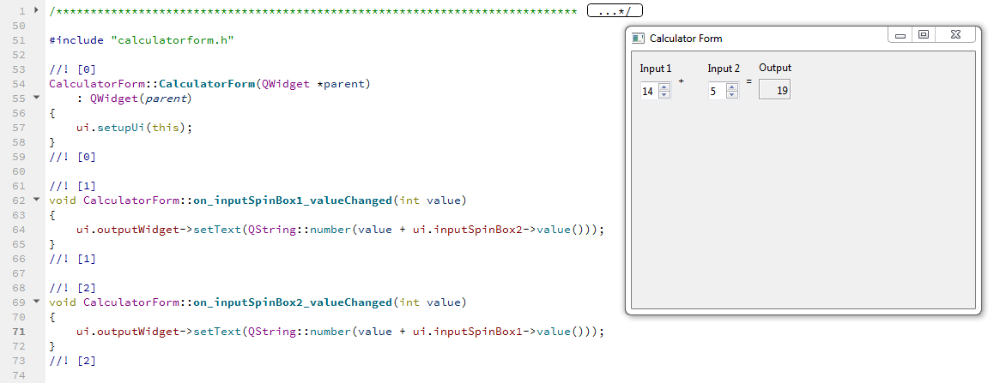
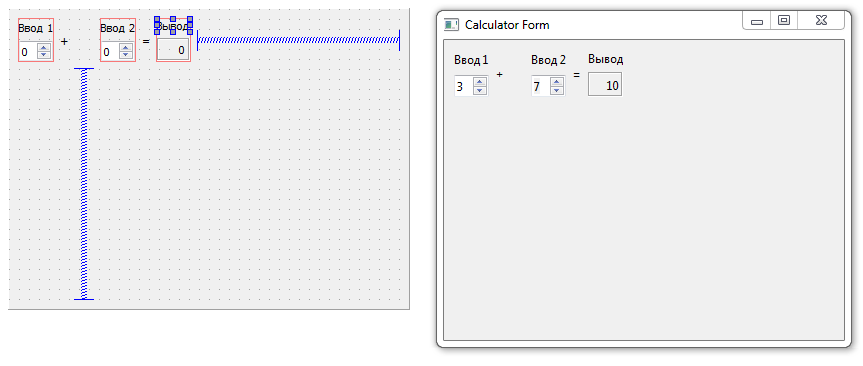

<p align="center">МИНИСТЕРСТВО НАУКИ  И ВЫСШЕГО ОБРАЗОВАНИЯ РОССИЙСКОЙ ФЕДЕРАЦИИ<br>
Федеральное государственное автономное образовательное учреждение высшего образования<br>
"КРЫМСКИЙ ФЕДЕРАЛЬНЫЙ УНИВЕРСИТЕТ им. В. И. ВЕРНАДСКОГО"<br>
ФИЗИКО-ТЕХНИЧЕСКИЙ ИНСТИТУТ<br>
Кафедра компьютерной инженерии и моделирования</p>
<br>

<h3 align="center">Отчёт по лабораторной работе № 4<br> по дисциплине "Программирование"</h3>

<br><br>

<p>студента 1 курса группы ПИ-б-о-202(1)<br>
Бойченко Сергея Павловича<br>
направления подготовки 09.03.04 "Программная инженерия"</p>
<br><br>

<table>
<tr><td>Научный руководитель<br> старший преподаватель кафедры<br> компьютерной инженерии и моделирования</td>
<td>(оценка)</td>
<td>Чабанов В.В.</td>
</tr>
</table>
<br><br>

<p align="center">Симферополь, 2020</p>
<hr>

## Цель:


1. Установить фреймворк Qt;
2. Изучить основные возможности создания и отладки программ в IDE Qt Creator.

## Постановка задачи
Настроить рабочее окружение, для разработки программного обеспечения при помощи Qt и IDE Qt Creator, а также изучить базовые возможности данного фреймворка.

## Выполнение работы

### Задание 1

Скачиваем программу Qt, устанавливаем и запускаем. Далее в примерах ищем нужную нам программу. После этого запускаем ее, тем самым проверяя работоспособность и правильность работы Qt. (Рис. 1)



Рисунок 1. Проверка на работоспособность Qt.

Переходим в папаку "Формы" и меняем значения Input 1", "Input 2", "Output" на "Ввод 1", "Ввод 2" и "Вывод" соответственно. (Рис. 2)



Рисунок 2. Измененные названия параметров.

### Задание 2

1. Инструменты - Параметры - Среда - Тема.
2. Ctrl + /
3. Пкм по папке - Показать в проводнике.
4. .pro
5. Ctrl + R
6. F5
7. Как в Visual Studio (левее от номера строки)

### Задание 3

Создаем консольное приложение без Qt и изменяем содержание.

```c++
#include <iostream>
 
int main() {
    int i;
    double d;
    i = 5;
    d = 5;
    std::cout << i << d;
}
```

После этого ставим поинты на 6, 7 и 8 строки. Запускаем режим откладки.


Рисунок 3. Значение переменных в 6 строке.


Рисунок 4. Значение переменных в 7 строке.


Рисунок 5. Значение переменных в 8 строке.

## Вывод по работе. 

Цель работы была успешно достигнута. Было выполнено:
- Установка Qt Creator, ознакомление с интерфейсом программы.
- Создание каталога и запуск первой программы.
